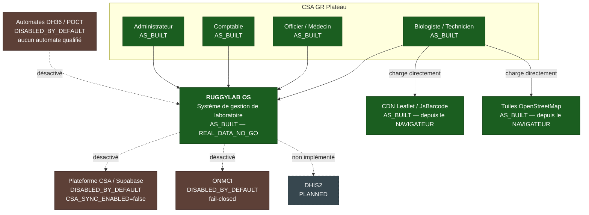
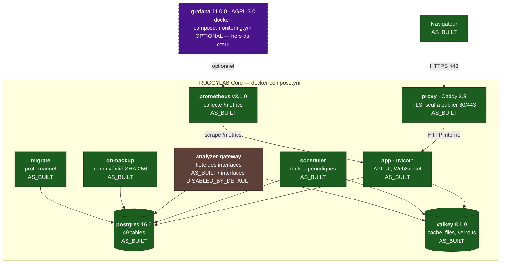
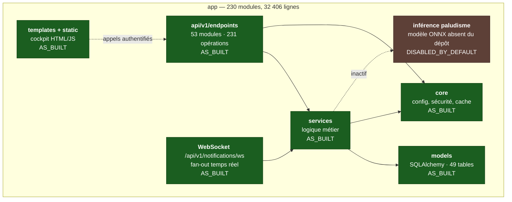
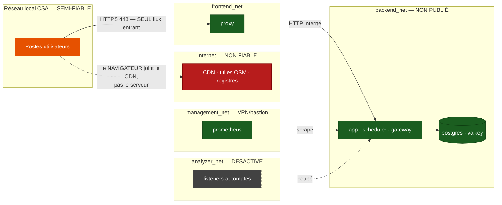

# G0 — C4 et architecture as-built

> **Chaque élément porte son statut réel.** Une architecture souhaitée
> présentée comme installée est pire qu'une absence de diagramme : elle donne
> confiance à tort.

| Statut | Signification |
| --- | --- |
| `AS_BUILT` | existe et fonctionne, vérifié en CI |
| `OPTIONAL` | existe, hors du cœur distribué, activé au choix de l'exploitant |
| `DISABLED_BY_DEFAULT` | le code existe, l'exécution est coupée par un réglage |
| `PLANNED` | n'existe pas — projeté |

Les services du diagramme Conteneurs sont **vérifiés contre
`docker-compose.yml`** par `tests/test_g0_inventory.py` : un service présent
dans l'un et absent de l'autre fait échouer le test.

## 1. C4 — Contexte système

> **Les CDN partent du navigateur, pas du serveur.** RUGGYLAB ne les appelle
> jamais ; c'est le poste client qui les joint. La distinction compte pour la
> conformité comme pour un déploiement hors ligne.

## 2. C4 — Conteneurs

**Neuf services dans le cœur.** Grafana n'y est pas : il vit dans un overlay
séparé, et l'absence de Grafana est le **mode nominal supporté**, pas un mode
dégradé.

## 3. C4 — Composants du conteneur `app`

## 4. Frontières de confiance et de réseau

### Flux autorisés et interdits

| Flux | État | Vérifié par |
| --- | --- | --- |
| Poste → proxy, HTTPS 443 | **autorisé** — seul flux entrant | `docker-stack` : seul le proxy publie des ports |
| Proxy → `/metrics`, `/docs`, `/redoc`, `/openapi.json` | **interdit** — 404 | `docker-stack` §14 |
| Prometheus → `app:8000/metrics` | autorisé, réseau interne | `docker-stack` |
| App → CSA / ONMCI | **coupé par défaut** | `CSA_SYNC_ENABLED=false` |
| Automate → gateway | **coupé par défaut** | `ENABLE_DH36_LISTENER=false` |
| Bind analyseur sur `0.0.0.0` | **refusé au démarrage** | `app/core/config.py` |
| Navigateur → CDN, tuiles | autorisé, **hors serveur** | — |

## 5. Points uniques de panne

| Composant | Effet de sa perte | Continuité |
| --- | --- | --- |
| **`postgres`** | arrêt total | sauvegarde vérifiée + restauration testée en CI |
| **`proxy`** | plus d'accès utilisateur | interne intact ; redémarrage du conteneur |
| `app` | plus d'API | conteneur unique — `restart: unless-stopped` |
| `valkey` | dégradation | cache reconstitué ; **denylist de jetons perdue** |
| `scheduler` | tâches suspendues | pas de perte de données |
| `prometheus` | plus de métriques | aucun effet clinique |
| `grafana` | **aucun** | hors du cœur |

> **Un seul exemplaire de chaque service.** Aucune redondance, aucun
> basculement automatique : c'est une architecture mono-hôte, adaptée à un
> centre unique. La continuité repose sur la **sauvegarde** et sur le
> **fonctionnement papier de secours**, pas sur la haute disponibilité. Le
> dire est plus utile que de laisser croire l'inverse.

## 6. Mécanismes de continuité

| Mécanisme | Statut |
| --- | --- |
| Sauvegarde PostgreSQL automatique, somme SHA-256 | `AS_BUILT` |
| Restauration dans une base vierge, testée en CI | `AS_BUILT` |
| Copie hors machine | **`PLANNED`** — non instrumentée |
| Redémarrage automatique des conteneurs | `AS_BUILT` |
| Verrou de migration au démarrage | `AS_BUILT` |
| Mode dégradé papier | `AS_BUILT` (procédure), hors logiciel |
| Réplication / bascule | **`PLANNED`** — inexistant |

> **La copie hors machine est `PLANNED`, et c'est un P1.** Une sauvegarde qui
> reste sur la machine sauvegardée ne protège pas d'une perte de la machine.
> Transmis au lot D.
