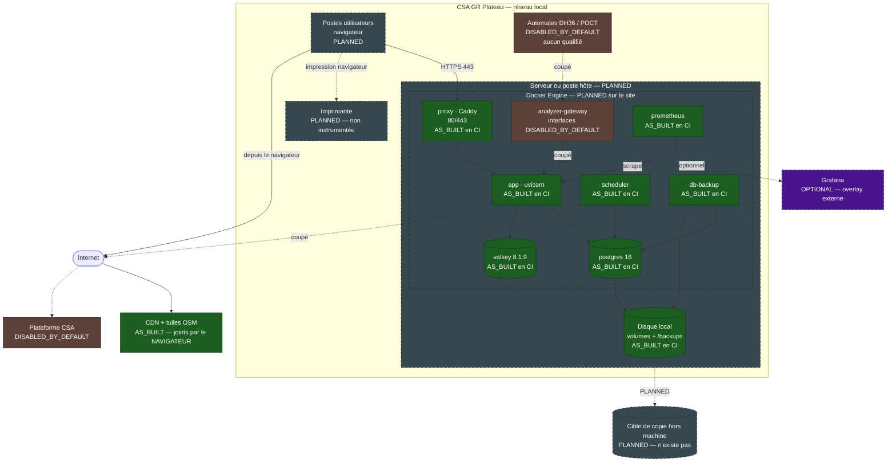

# G0 — Vue de déploiement : CSA GR Plateau

> **INTERNAL — SECURITY ARCHITECTURE**
> **BASELINE TECHNIQUE — NOT FOR OPERATIONAL DEPLOYMENT**
>
> Ce document décrit une architecture de référence, pas une installation. Il ne
> contient aucune adresse IP réelle de site, aucun identifiant, aucun secret,
> aucun nom de compte, aucune topologie VLAN réelle et aucune donnée patient —
> et il ne doit pas en recevoir tant que le dépôt reste public.
>
> Ce bandeau est une **mention de classification, pas un contrôle d'accès** : il
> n'empêche personne de lire ce fichier. Le seul contrôle réel serait la
> visibilité du dépôt.

> **Ce document décrit une cible d'évaluation, pas une installation en
> service.** `CLINICAL_STATUS = REAL_DATA_NO_GO` et
> `DISTRIBUTION_STATUS = DISTRIBUTION_NO_GO` : à ce jour, **rien n'est
> installé sur le site**. Chaque élément porte donc son statut, et la majorité
> est `PLANNED`.
>
> Présenter une architecture souhaitée comme déjà en place serait la faute la
> plus coûteuse de tout G0.

## 1. Vue de déploiement

## 2. Chaque élément, et son statut

| Élément | Statut | Précision |
| --- | --- | --- |
| **Serveur / poste hôte** | `PLANNED` | non désigné, non dimensionné, non installé |
| **Docker Engine sur site** | `PLANNED` | la pile ne tourne aujourd'hui qu'en CI et en local |
| Proxy HTTPS (Caddy) | `AS_BUILT` **en CI** | seul service publiant 80/443 |
| Application | `AS_BUILT` **en CI** | flux clinique synthétique 15/15 |
| PostgreSQL 16 | `AS_BUILT` **en CI** | 49 tables, tête `20260826_0043` |
| Valkey 8.1.9 | `AS_BUILT` **en CI** | 17 contrôles runtime passés |
| Prometheus | `AS_BUILT` **en CI** | `up{job="ruggylab-os"} = 1` |
| Sauvegardes | `AS_BUILT` **en CI** | dump + SHA-256 + restauration testée |
| **Postes utilisateurs** | `PLANNED` | ni recensés, ni configurés |
| **Imprimante** | `PLANNED` | impression par le navigateur, **non instrumentée** |
| **Réseau local** | `PLANNED` | segmentation du site non décrite |
| **Cible de copie hors machine** | `PLANNED` | **n'existe pas** — voir §4 |
| Automates | `DISABLED_BY_DEFAULT` | **aucun automate physique qualifié** |
| Systèmes externes (CSA, ONMCI) | `DISABLED_BY_DEFAULT` | coupés par configuration |
| CDN et tuiles OSM | `AS_BUILT` | joints par le **navigateur**, pas par le serveur |
| Grafana | `OPTIONAL` | overlay externe, hors du cœur |

> **« `AS_BUILT` en CI » n'est pas « installé sur le site ».** La distinction
> est le cœur de ce document. Les composants existent, démarrent et sont
> qualifiés — sur un runner GitHub et en local. Aucun n'a jamais tourné au CSA
> GR Plateau.

## 3. Fonctionnement papier de secours

| | |
| --- | --- |
| Statut | `AS_BUILT` en tant que **procédure**, hors logiciel |
| Déclencheur | indisponibilité du serveur, du réseau ou de l'électricité |
| Mode | registres papier, comme avant RUGGYLAB |
| Reprise | ressaisie manuelle après rétablissement |

Le mode papier reste, à ce jour, **le seul mode réellement en service** au CSA
GR Plateau. Ce n'est pas une porte de sortie théorique : c'est l'existant.

> **Un point qu'aucun document ne couvre encore** : la procédure de **reprise**
> après un épisode papier — qui ressaisit, dans quel ordre, avec quelle
> traçabilité de l'origine papier. Transmis au lot D en **P1**.

## 4. Sauvegarde : ce qui existe et ce qui manque

| Étape | Statut |
| --- | --- |
| Dump PostgreSQL automatique | `AS_BUILT` |
| Somme SHA-256 du dump | `AS_BUILT` |
| Restauration dans une base vierge, testée en CI | `AS_BUILT` |
| Écriture sur le disque local | `AS_BUILT` |
| **Copie hors machine** | **`PLANNED`** |
| **Test de restauration depuis la copie hors machine** | **`PLANNED`** |
| Chiffrement des sauvegardes | **`PLANNED`** |

> **P1 — une sauvegarde qui ne quitte pas la machine ne protège pas de la perte
> de la machine.** Vol, incendie, panne de disque, chiffrement par rançongiciel :
> dans chacun de ces cas, le dump disparaît avec la base qu'il sauvegarde. La
> chaîne est correcte jusqu'au disque local, et s'arrête là.
>
> **P1 — les sauvegardes ne sont pas chiffrées.** Un dump contient l'intégralité
> des données. Sans objet aujourd'hui puisque `REAL_DATA_NO_GO` interdit les
> données réelles ; bloquant le jour où ce statut serait levé.

## 5. Ce qui devra être décidé avant toute installation

Ces points ne relèvent pas de G0 — ils sont listés pour que le lot D les
recueille, non pour être tranchés ici.

| Question | Pourquoi elle bloque |
| --- | --- |
| Quel hôte, quelles ressources ? | dimensionne tout le reste |
| Le poste est-il sur le VLAN clinique ? | détermine l'exposition réelle |
| Qui administre la machine ? | personne n'est désigné |
| Où va la copie hors machine ? | condition de la continuité |
| Comment les comptes utilisateurs sont-ils créés et révoqués ? | non instrumenté |
| Que se passe-t-il en cas de coupure électrique ? | onduleur non prévu |
| Qui est joignable en cas d'incident ? | aucune astreinte définie |

## 6. Constats transmis au lot D

| Constat | Classement |
| --- | --- |
| Copie de sauvegarde hors machine inexistante | **P1** |
| Sauvegardes non chiffrées | **P1** (P0 si `REAL_DATA_NO_GO` était levé) |
| Procédure de reprise après épisode papier non écrite | **P1** |
| Hôte, réseau et postes du site non spécifiés | **P2** |
| Aucune redondance, aucun basculement | **P2** — assumé pour un centre unique |
| Impression non instrumentée | **P2** |
